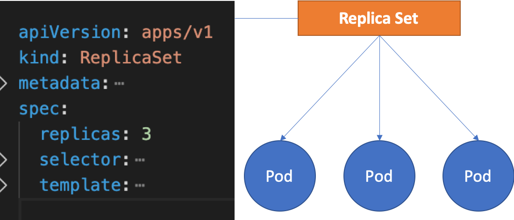

# ReplicaSet
* ReplicaSet là một điều khiển Controller - nó đảm bảo ổn định các nhân bản (số lượng và tình trạng của POD, replica) khi đang chạy.

* Cách thức hoạt động:

    Khi định nghĩa một ReplicaSet (định nghĩa trong file .yaml) gồm các trường thông tin, gồm có trường selector để chọn ra các các Pod theo label, từ đó nó biết được các Pod nó cần quản lý(số lượng POD có đủ, tình trạng các POD). Trong nó nó cũng định nghĩa dữ liệu về Pod trong spec template, để nếu cần tạo Pod mới nó sẽ tạo từ template đó. Khi ReplicaSet tạo, chạy, cập nhật nó sẽ thực hiện tạo / xóa POD với số lượng cần thiết trong khai báo (repilcas).
* Example:
```
apiVersion: apps/v1
kind: ReplicaSet
metadata:
  name: rsapp
spec:
  replicas: 3
  selector:
    matchLabels:
      app: rsapp
  template:
    metadata:
      name: rsapp
      labels:
        app: rsapp
    spec:
      containers:
      - name: app
        image: ichte/swarmtest:node
        resources:
          limits:
            memory: "128Mi"
            cpu: "100m"
        ports:
          - containerPort: 8085
```
* Dòng `Controlled By: ReplicaSet/rsapp` điều này có nghĩa Pod được kiểm soát điều khiển bởi ReplicaSet có tên rsapp.
* Nếu xóa Pod, ReplicaSet sẽ thay bằng Pod mới. Nếu xóa ReplicaSet, Pod sẽ bị xóa
* Horizontal Pod Autoscaler với ReplicaSet:

    Horizontal Pod Autoscaler là chế độ tự động scale (nhân bản POD) dựa vào mức độ hoạt động của CPU đối với POD, nếu một POD quá tải - nó có thể nhân bản thêm POD khác và ngược lại - số nhân bản dao động trong khoảng min, max cấu hình
    ```
    kubectl autoscale rs rsapp --max=2 --min=1
    ```
    - Lệnh trên tạo ra một hpa có tên rsapp, có dùng tham chiếu đến ReplicaSet có tên rsapp để scale các POD với thiết lập min, max các POD

    Để linh loạt và quy chuẩn, nên tạo ra HPA (HorizontalPodAutoscaler) từ cấu hình file yaml:
    ```
    apiVersion: autoscaling/v1
    kind: HorizontalPodAutoscaler
    metadata:
    name: rsapp-scaler
    spec:
    scaleTargetRef:
        apiVersion: apps/v1
        kind: ReplicaSet
        name: rsapp
    minReplicas: 5
    maxReplicas: 10
    # Thực hiện scale CPU hoạt động ở 50% so với CPU mà POD yêu cầu
    targetCPUUtilizationPercentage: 50
    ```
    `Mặc dù có thể sử dụng ReplicaSet một cách độc lập, tuy nhiên trong triển khai hiện nay hay dùng Deployment, với Deployment nó sở hữu một ReplicaSet riêng.`


