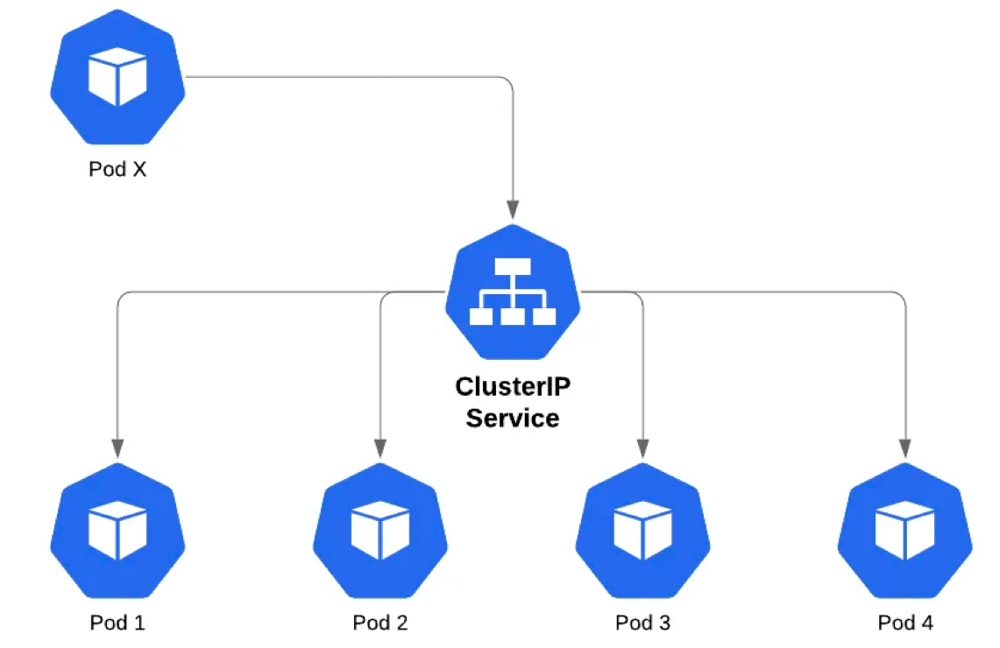

# Service và Secret Tls
* Mặc dù mỗi POD khi tạo ra nó có một IP để liên lạc, tuy nhiên vấn đề là mỗi khi POD thay thế thì là một IP khác, nên các dịch vụ truy cập không biết IP mới nếu ta cấu hình nó truy cập đến POD nào đó cố định. Để giải quết vấn đề này sẽ cần đến Service.
* Service (micro-service) là một đối tượng trừu tượng nó xác định ra một nhóm các POD và chính sách để truy cập đến POD đó. Nhóm cá POD mà Service xác định thường dùng kỹ thuật Selector (chọn các POD thuộc về Service theo label của POD).

* Cũng có thể hiểu Service là một dịch vụ mạng, tạo cơ chế cân bằng tải (load balancing) truy cập đến các điểm cuối (thường là các Pod) mà Service đó phục vụ.
* Tạo Service Kubernetes
```
apiVersion: v1
kind: Service
metadata:
  name: svc1
spec:
  type: ClusterIP
  ports:
    - name: port1
      port: 80
      targetPort: 80
```
* [Kiểu service](https://viblo.asia/p/nodeport-vs-ingress-vs-loadbalancer-trong-kubernetes-1VgZvrgRZAw): `ClusterIP`, đây là kiểu mặc định (ngoài ra còn có kiểu `NodePort, LoadBalancer, ExternalName`)
* Tạo EndPoint cho Service (không selector):
    
    Service trên có tên svc1, không có selector để xác định các Pod là endpoint của nó, nên có thể tự tạo ra một endpoint cùng tên svc1
```
apiVersion: v1
kind: Endpoints
metadata:
  name: svc1
subsets:
  - addresses:
      - ip: 216.58.220.195      # đây là IP google
    ports:
      - name: port1
        port: 80
```

* Như vậy svc1 đã có endpoints, khi truy cập svc1:80 hoặc svc1.default:80 hoặc IP:80 có nghĩa là truy cập 216.58.220.195:80

* Do có dịch vụ CoreDns nên có thể truy cập thông qua phân giải tên, truy cập đến service theo cấu trúc `namespace.servicename` nếu cùng namespace chỉ cần `servicenname`
* Ví dụ trên sử dụng Service (không có Selector), cần tạo Endpoint có tên cùng tên Service: dùng loại này khi cần tạo ra một điểm truy cập dịch vụ tương tự như proxy đến một địa chỉ khác (một server khác, một dịch vụ khác ở namespace khác ...)


